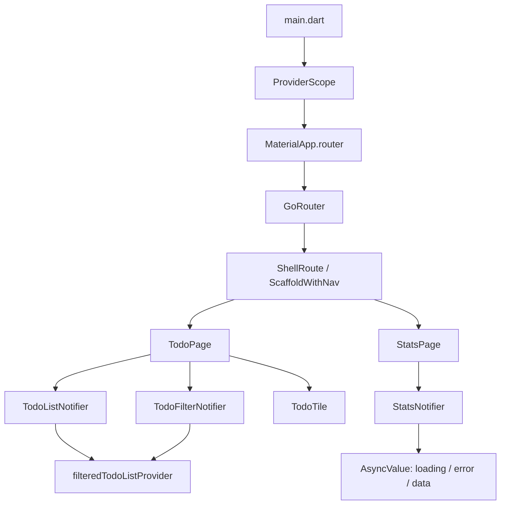

# Laporan Praktikum Pemrograman Mobile

## Week 3: Declarative Navigation, State Management with Riverpod, and Automated Testing

Dokumen ini merupakan laporan teknis implementasi tugas praktikum Week 3 pada aplikasi Flutter **ToDo Riverpod**. Praktikum berfokus pada navigasi deklaratif, pengelolaan state sinkron dan asynchronous dengan Riverpod, refactoring arsitektur, serta unit dan widget testing.

**Repository GitHub:** [IlhamDharm/244107020220-mobile-course](https://github.com/IlhamDharm/244107020220-mobile-course.git)

## 1. Identitas dan Stack Teknologi

| Komponen | Teknologi / Versi | Peran |
| --- | --- | --- |
| Framework | Flutter 3.x | Pengembangan aplikasi lintas platform |
| Bahasa | Dart 3.13.2 atau kompatibel | Implementasi aplikasi dan test |
| Router | `go_router` 18.0.1 | Navigasi deklaratif berbasis URL |
| State management | `flutter_riverpod` 3.4.3 | State immutable, `Notifier`, dan `AsyncNotifier` |
| Testing | `flutter_test` | Unit testing dan widget testing |
| UI | Material 3 | Komponen antarmuka dan navigasi bawah |

Dependency utama didefinisikan di [`pubspec.yaml`](../pubspec.yaml). Aplikasi menggunakan `ProviderScope` sebagai root provider dan `MaterialApp.router` sebagai entry point navigasi.

## 2. Tujuan Praktikum

1. Menerapkan navigasi deklaratif dengan `GoRouter` dan URL yang dapat dibaca.
2. Memahami state immutable menggunakan `Notifier` modern Riverpod 3.x.
3. Memodelkan lifecycle asynchronous: loading, error, dan success.
4. Memisahkan widget dan state agar kode lebih modular serta mudah diuji.
5. Membuat unit test dan widget test untuk memverifikasi perilaku aplikasi.

## 3. Struktur Kode

```text
lib/
├── main.dart                    # ProviderScope, GoRouter, ShellRoute, NavigationBar
├── pages/
│   ├── todo_page.dart            # Daftar tugas dan filter
│   └── stats_page.dart           # Rendering state statistik asynchronous
├── providers/
│   ├── todo_provider.dart        # Todo, filter, dan derived provider
│   ├── product_provider.dart     # AsyncNotifier produk dan refresh
│   └── stats_provider.dart       # AsyncNotifier statistik dengan simulasi error
└── widgets/
    └── todo_tile.dart            # Item tugas reusable berbasis ConsumerWidget

test/
├── stats_provider_test.dart      # Unit test lifecycle AsyncValue
└── todo_widget_test.dart         # Widget test tambah tugas
```

## 4. Tahapan Praktikum dan Hasil Implementasi

### 4.1 Bagian 1 dan 2: Declarative Navigation dengan GoRouter

Pada tahap awal, navigasi dibangun dengan URL deklaratif menggunakan rute `/` untuk Home dan `/detail/:id` untuk halaman detail. Parameter path diparsing dari `state.pathParameters['id']`, sedangkan data tambahan antar halaman dapat dikirim melalui `state.extra`. Pendekatan ini mendukung deep linking dan tombol back browser.

Konfigurasi debug banner dihilangkan pada root aplikasi:

```dart
return MaterialApp.router(
  debugShowCheckedModeBanner: false,
  routerConfig: _router,
);
```

**Lampiran bukti:** simpan screenshot pada `docs/screenshots/01-home-list.png`.


### 4.2 Bagian 3: State Management Dasar dengan Riverpod

Root widget dibungkus `ProviderScope` agar semua provider dapat diakses oleh widget di bawahnya:

```dart
void main() => runApp(const ProviderScope(child: MyApp()));
```

`TodoListNotifier` menggunakan `Notifier<List<Todo>>`. Operasi tambah, ubah status selesai, dan hapus membuat list baru, bukan memodifikasi referensi state secara langsung.

```dart
class TodoListNotifier extends Notifier<List<Todo>> {
  @override
  List<Todo> build() => const [];

  void add(String title) {
    state = [...state, Todo(title)];
  }

  void toggle(int index) {
    final todos = [...state];
    todos[index] = todos[index].copyWith(done: !todos[index].done);
    state = todos;
  }
}
```

Ketika list kosong, `TodoPage` menampilkan teks **Belum ada tugas**. Tugas baru ditambahkan melalui `FloatingActionButton`, modal dialog, `TextField`, dan tombol **Tambah**.

**Lampiran bukti:** simpan screenshot keadaan awal pada `docs/screenshots/02-todo-empty.png`.


### 4.3 Bagian 4: AsyncValue Lifecycle

`ProductsNotifier` merupakan turunan `AsyncNotifier<List<String>>`. Method `build()` mensimulasikan latency dua detik. UI merespons tiga kemungkinan state tanpa flag loading manual.

```dart
class ProductsNotifier extends AsyncNotifier<List<String>> {
  @override
  Future<List<String>> build() async {
    await Future.delayed(const Duration(seconds: 2));
    return ['Keyboard', 'Mouse', 'Monitor'];
  }

  Future refresh() async {
    state = const AsyncLoading();
    state = await AsyncValue.guard(() => _fetch());
  }
}
```

Rendering deklaratif menggunakan `.when()`:

```dart
body: productsAsync.when(
  loading: () => const Center(child: CircularProgressIndicator()),
  error: (error, stackTrace) => ErrorView(
    error: error,
    onRetry: () => ref.invalidate(productsProvider),
  ),
  data: (products) => ListView.builder(
    itemCount: products.length,
    itemBuilder: (context, index) => Text(products[index]),
  ),
),
```

Lifecycle yang diverifikasi adalah **loading** dengan `CircularProgressIndicator`, **error** dengan exception dan tombol retry melalui `ref.invalidate`, serta **success** dengan list produk. Pada refresh, stale data idealnya dipertahankan sampai data baru tersedia untuk mengurangi layout shift. Hasil tahap ini menampilkan `Keyboard`, `Mouse`, dan `Monitor`.


### 4.4 Bagian 5: AI Challenge dan Testing Riverpod 3.x

`StatsNotifier` mensimulasikan permintaan asynchronous selama dua detik dengan probabilitas error 30%. Jika berhasil, provider mengembalikan tiga metrik statistik; jika gagal, `StatsPage` menampilkan pesan error dan tombol **Coba Lagi**.

| Checklist verifikasi AI | Status |
| --- | :---: |
| State data tidak dimutasi langsung (immutable update) | [x] |
| `ref.watch` hanya dipanggil di dalam `build()` | [x] |
| `ref.invalidate` dipakai pada event handler retry | [x] |
| Loading, error, dan data ditangani lengkap dengan `.when()` | [x] |
| Menggunakan `Notifier` / `AsyncNotifier` modern | [x] |
| Tidak menggunakan `StateNotifier` atau `StateProvider` lama | [x] |
| Unit test menggunakan `ProviderContainer` dan `ref.listen` | [x] |
| Pemeriksaan tipe memakai `AsyncError` / `AsyncData` Riverpod 3.x | [x] |

Unit test pada [`test/stats_provider_test.dart`](../test/stats_provider_test.dart) membaca state awal, mendengarkan transisi asynchronous, lalu memverifikasi hasil akhir sebagai `AsyncError` atau `AsyncData`. Hasil eksekusi historis: **00:03 +1: All tests passed!**

### 4.5 Bagian 6: Refactoring Arsitektur, ShellRoute, dan Widget Testing

Refactoring akhir menghasilkan perubahan berikut:

- `TodoTile` dipisahkan menjadi `ConsumerWidget` di [`lib/widgets/todo_tile.dart`](../lib/widgets/todo_tile.dart).
- `TodoFilterNotifier` mengelola filter `all`, `active`, dan `completed` melalui method publik `setFilter()`.
- `filteredTodoListProvider` menjadi derived provider yang membaca daftar tugas dan filter aktif.
- `ShellRoute` mempertahankan `Scaffold` dan `NavigationBar` saat berpindah antara ToDo dan Statistik.
- `SegmentedButton` menyediakan filter Semua, Aktif, dan Selesai.
- [`test/todo_widget_test.dart`](../test/todo_widget_test.dart) memvalidasi input form dan penambahan tugas baru.

Contoh filter immutable dan derived provider:

```dart
class TodoFilterNotifier extends Notifier<TodoFilter> {
  @override
  TodoFilter build() => TodoFilter.all;

  void setFilter(TodoFilter filter) {
    state = filter;
  }
}

final filteredTodoListProvider = Provider<List<Todo>>((ref) {
  final todos = ref.watch(todoListProvider);
  final filter = ref.watch(todoFilterProvider);

  switch (filter) {
    case TodoFilter.active:
      return todos.where((todo) => !todo.done).toList();
    case TodoFilter.completed:
      return todos.where((todo) => todo.done).toList();
    case TodoFilter.all:
      return todos;
  }
});
```

Contoh konfigurasi `ShellRoute` final:

```dart
ShellRoute(
  builder: (context, state, child) => ScaffoldWithNav(child: child),
  routes: [
    GoRoute(path: '/', builder: (context, state) => const TodoPage()),
    GoRoute(path: '/stats', builder: (context, state) => const StatsPage()),
  ],
),
```

**Lampiran bukti UI refactoring:**


## 5. Arsitektur Aplikasi Final



### Alur ToDo

1. `TodoPage` memanggil `ref.watch(filteredTodoListProvider)` saat build.
2. Provider turunan menerapkan filter terhadap state `todoListProvider`.
3. `TodoTile` membaca notifier dengan `ref.read` pada event checkbox atau hapus.
4. Perubahan state membuat widget yang berlangganan melakukan rebuild.

### Alur Statistik

1. `StatsPage` memanggil `ref.watch(statsProvider)` saat build.
2. `StatsNotifier.build()` menjalankan pekerjaan asynchronous.
3. Riverpod mempublikasikan `AsyncLoading`, lalu `AsyncData` atau `AsyncError`.
4. `.when()` memilih UI yang sesuai; retry memanggil `ref.invalidate(statsProvider)`.

## 6. Prosedur Menjalankan dan Menguji

```bash
flutter pub get
flutter run
flutter analyze
flutter test
```

Hasil verifikasi akhir:

| Perintah | Hasil |
| --- | --- |
| `flutter analyze` | **No issues found!** |
| `flutter test` | **00:37 +2: All tests passed!** |

## 7. Prosedur Git

Staging dilakukan secara selektif agar hanya kode inti, test, dan manifest dependency yang dikirim:

```bash
git add lib/ test/ pubspec.yaml
git commit -m "feat: complete week 3 refactoring and testing"
git push origin main
```

## 8. Kesimpulan

Praktikum Week 3 berhasil menggabungkan navigasi deklaratif berbasis URL, state management Riverpod 3.x, pemrosesan asynchronous dengan `AsyncValue`, refactoring berbasis komponen, dan automated testing. Hasil akhir memiliki pemisahan tanggung jawab yang jelas: router mengatur navigasi, provider mengatur state, page merender state, widget menangani unit UI, dan test memverifikasi perilaku pengguna serta lifecycle asynchronous.

## Referensi

- [Flutter documentation](https://docs.flutter.dev/)
- [go_router package](https://pub.dev/packages/go_router)
- [Riverpod documentation](https://riverpod.dev/)
- [flutter_test documentation](https://api.flutter.dev/flutter/flutter_test/flutter_test-library.html)
